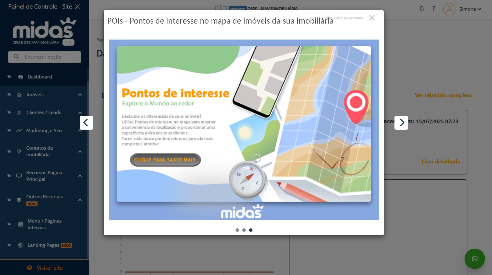

# FASE-2-WEB-DESIGNER: TESTES PRÁTICOS DE IMAGENS

Exercício 1: Analisar o design de um pop-up e propor um redesenho, caso julgue necessário.

Exercício 2: Criar o layout visual (sem programação) de uma Landing Page, com base nos materiais fornecidos.
## Exercício 1
Analisar o design de um pop-up e propor um redesenho, caso julgue necessário.

O design passado foi esse: 

