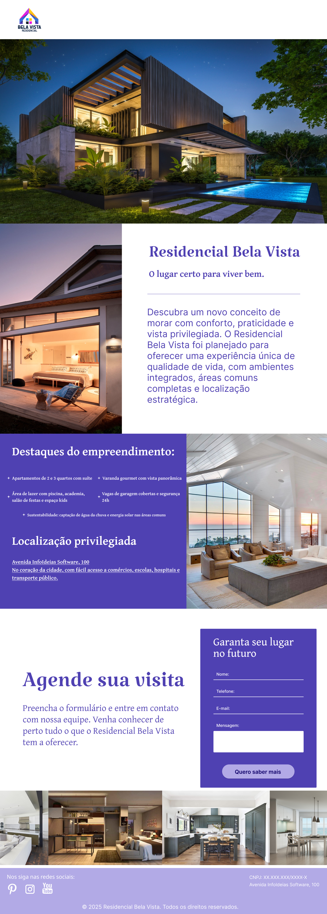

# FASE-2-WEB-DESIGNER: TESTES PRÁTICOS DE IMAGENS

Exercício 1: Analisar o design de um pop-up e propor um redesenho, caso julgue necessário.

Exercício 2: Criar o layout visual (sem programação) de uma Landing Page, com base nos materiais fornecidos.
## Exercício 1
Analisar o design de um pop-up e propor um redesenho, caso julgue necessário.

O design passado foi esse: 

Como primeira mudança, resolvi retirar a estrutura dessa moldura com a imagem dentro deixando a imagem em si sendo o popup e adicionando um x externo para fechar, mais condizente com a estrutura do painel:

O trabalho concluído foi respeitar a paleta de cor das fontes dos textos (com excessão do que está no botão), Uma fonte com uma aparência semelhante a uma escrita em um mapa mesmo, o *explore o mundo ao redor* com uma cor verde e uma fonte próxima da original, o texto foi utilizado na cor um cinza escuro retirado da parte mais escura da bússola:

O contraste para o texto que é algo com uma quantidade de letras alta para se ter uma leitura teve um tom que passa na estrutura de contraste. Houve um redesenho no botão, tentando manter a paleta de cor do pop up, sem ficar algo muito dissonante do resto, mas ainda sendo um botão, adicionando uma sombras e um degrade para dar uma sensação de profundidade:

## Exercício 2
Criar o layout visual (sem programação) de uma Landing Page, com base nos materiais fornecidos.

## ✨ Análise e Implementação do Layout

A landing page foi desenvolvida para ser visualmente atraente e altamente funcional, seguindo as diretrizes do desafio e o layout fornecido:

1.  **Cabeçalho:**
    * No canto superior esquerdo, foi integrado o **logotipo do Residencial Bela Vista**, conforme a imagem. Embora a imagem forneça apenas a parte superior do logo, a implementação visa a completa visualização e reconhecimento da marca.

2.  **Seção Principal (Hero Section):**
    * Apresenta uma **imagem principal impactante** de uma residência moderna com piscina, ocupando a largura total do topo da página. Esta imagem serve como o principal atrativo visual.

3.  **Seções de Conteúdo e Destaques:**
    * **"Residencial Bela Vista: O lugar certo para viver bem."**: Logo abaixo da imagem principal, um título centralizado e um parágrafo de texto institucional explicam o conceito e os diferenciais do empreendimento.
    * **Destaques do Empreendimento:** Uma seção com fundo roxo escuro que lista os principais atributos do condomínio, como "Lazer completo e exclusivo" e "Segurança 24 horas", reforçando os benefícios.
    * **Localização Privilegiada:** Detalhes sobre a localização, apresentando as vantagens de morar na região.
    * **Imagens Complementares:** Duas imagens laterais foram inseridas: uma ilustrando um interior elegante da casa e outra, ao lado dos destaques, mostrando um ambiente de sala/cozinha integrado, oferecendo uma visão mais detalhada dos espaços internos.

4.  **Formulário de Contato e CTA:**
    * **"Agende sua visita"**: Uma seção convidativa com um parágrafo que incentiva o agendamento.
    * **Formulário de Contato:** Localizado à direita da seção "Agende sua visita", com fundo roxo, contendo os campos obrigatórios:
        * `Nome`
        * `E-mail`
        * `Telefone`
        * `Mensagem`
    * **Botão CTA (Call to Action):** Com o texto **"Quero saber mais"**, posicionado abaixo dos campos do formulário, em destaque. A frase "Garanta seu lugar no futuro" também é utilizada acima do formulário, reforçando a urgência e o benefício.

5.  **Galeria de Imagens Inferior:**
    * Na parte inferior da página, há uma **galeria de imagens adicionais**, com múltiplas fotos em formato de carrossel ou grade (se implementado dinamicamente), apresentando diferentes ambientes internos como cozinha, sala e banheiro, para enriquecer a experiência visual.

6.  **Rodapé:**
    * Integrado na parte mais baixa da página, ele deve conter (mesmo que não visível na imagem completa) as informações essenciais como:
        * Ícones das redes sociais: **Instagram, Pinterest e YouTube**.
        * Informações de contato e legais da incorporadora.

7. Uma observação sobre o cabeçalho, ele aparenta estar vazio, porém é pensado que ao scrollar, ele fique fixo e tenha uma leve alteração no design:

